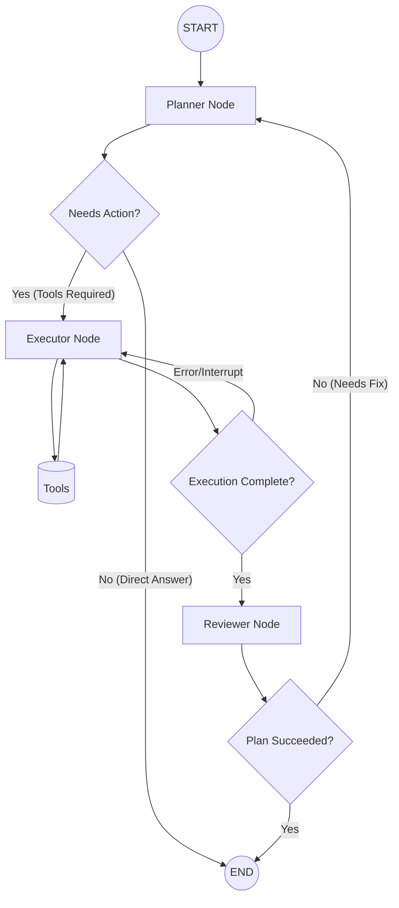

# Phase 2: Multi-Agent Architecture for DeployAI

## Overview
We are migrating `DeployAI` from a single `create_react_agent` node to a custom **StateGraph** with specialized nodes. This enables explicit reasoning, strictly defined execution constraints, and autonomous self-correction, which are heavily required for safe Linux Server Management.

## The New Graph Topology

## Step-by-Step Implementation

### Step 1: Upgrade the Global State Schema
**File:** `src/graph/state.py`
We need to track more than just `messages`. The state needs to manage the execution plan and the review status.
*   **`plan`**: `List[str]` — A list of chronological steps constructed by the Planner.
*   **`current_step`**: `int` — Which step the Executor is currently on.
*   **`review_status`**: `Literal["approved", "rejected"]` — The output from the Reviewer.

### Step 2: Build the Planner Node
**File:** `src/graph/nodes/planner.py`
*   **Responsibility**: Analyzes the user's input, queries the database (via `list_all_servers`/`get_server_info`) if necessary to get IPs, and generates a structured JSON plan (e.g., using `.with_structured_output()` or standard system prompts).
*   **LLM Role**: Operations Architect. It does *not* execute commands. It writes the game plan.

### Step 3: Build the Executor Node
**File:** `src/graph/nodes/executor.py`
*   **Responsibility**: Takes the `plan` from the state and executes ONLY the tools required for the `current_step`.
*   **HITL Integration**: We will keep the `interrupt_before=["tools"]` safeguard here.
*   **LLM Role**: System Administrator. It blindly follows the planner's instructions and focuses solely on parsing stdout/stderr from the `ssh_execute` tool securely.

### Step 4: Build the Reviewer Node
**File:** `src/graph/nodes/reviewer.py`
*   **Responsibility**: Looks at the user's original request, looks at the output generated by the Executor, and decides if the state of the server matches the desired outcome.
*   **Routing**: If the review fails (e.g., a service failed to restart), it kicks the state back to the Planner with an error report to try again. If it succeeds, it produces the final user-facing response.
*   **LLM Role**: QA / Senior DevOps Engineer.

### Step 5: Refactor the Main Graph Compiler
**File:** `src/graph/graph.py`
*   Replace `create_react_agent` with a custom `StateGraph(AgentState)`.
*   Define nodes: `.add_node("planner", planner_node)`, `.add_node("executor", executor_node)`, `.add_node("reviewer", reviewer_node)`.
*   Define conditional edges (Routers) to drive the state machine as defined in the Mermaid graph.

### Step 6: Update the CLI Loop
**File:** `src/cli/app.py`
*   Adjust the HITL `state.next` logic. Instead of looking for `state.next[0] == "tools"`, we might look for the specific tool node depending on how we define it, or ensure our manual prompt respects the new executor's tool calls.

## Why this Architecture?
If a user asks: `"Update nginx and check if it's running on prod."`
*   **Phase 1 (Current)**: Tries to `ssh` to update, might fail, tries to re-run, forgets to check the status, outputs partial string.
*   **Phase 2 (Proposed)**: 
    1. **Planner** writes: `[1. Run apt update, 2. Run apt install nginx, 3. Run systemctl status nginx]`.
    2. **Executor** strictly runs step 1, 2, and 3. Wait for HITL approval on each.
    3. **Reviewer** reads the systemctl text to ensure it says `active (running)`. If it says `failed`, the Reviewer tells the Planner to generate a debugging plan.
